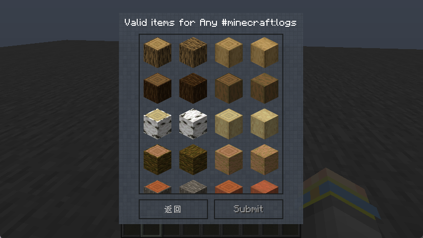

# 这是在 FTB Quests MOD 中制作物品任务的一些方案

  
想要了解 FTB Quests MOD ?

  [Curseforge Fabric](https://www.curseforge.com/minecraft/mc-mods/ftb-quests-fabric) 
  [Curseforge Forge](https://www.curseforge.com/minecraft/mc-mods/ftb-quests-forge) 
  [MC 百科](https://www.mcmod.cn/class/1423.html)

  
低版本：物品列表

  <h2>1. 创建一个“物品”任务，打开任务，对任务目标的物品右键，点击编辑</h2>

   

  <h2>2. 点击“物品列表”</h2>

   

  <h2>3. 点击“添加”，</h2>

   

  <h2>4. 就这样，好了，玩家获得有效物品中的任意一种就会完成该任务</h2>

   

  
低版本：转矿物词典

  <h2>1. 创建一个“物品”任务，打开任务，对任务目标的物品右键，点击“Convert to Ore Dictionary item”</h2>

   

  <h2>2. yes 转矿物词典就是这么快</h2>

   

  <h2>3. 点击查看有效物品，查看当前任务匹配的物品，确保是你想要的</h2>

   

  
高版本：或过滤器

  <h2>1. 在创造模式物品栏中，找到“item filter”项，并拿出“or fiter”，以及你所需要匹配的物品</h2>

   

  <h2>2. 手持过滤器，右键打开，将需要匹配的物品放入</h2>

   

  <h2>3. 创建一个“物品”任务，列出模式切换至“物品栏”，选择刚才调整好的过滤器</h2>

   

  <h2>4. 点击查看有效物品，查看当前任务匹配的物品，确保是你想要的</h2>

   

  <h2>5. 显示这样就大功告成了，如果只显示“or filter”这个物品，没有显示添加的物品列表 
  你需要安装模组“ftb xmod compat”，以让过滤器正常工作</h2>

   

  
高版本：转标签（其实就是用“标签过滤器”）

  <h2>1. 创建一个“物品”任务，打开任务，对任务目标的物品右键，点击“Convert to 'Item Filters' Tag Filter”</h2>

   

  <h2>2. 按需选择标签，每一个标签匹配的物品可能会不一样</h2>

   

  <h2>3. 显示这样就大功告成了，如果该步骤并未生效，还请检查是否已安装模组“ftb xmod compat”</h2>

   

  <h2>4. 点击查看有效物品，查看当前任务匹配的物品，确保是你想要的</h2>

   

